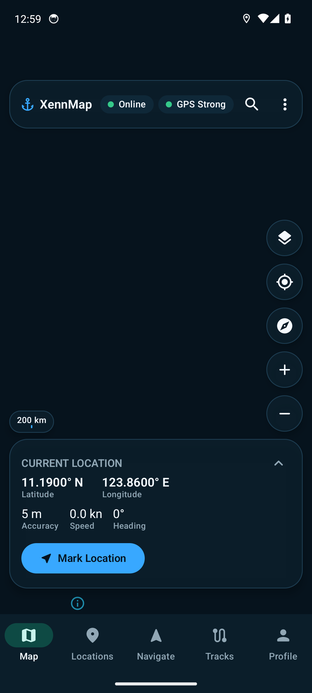
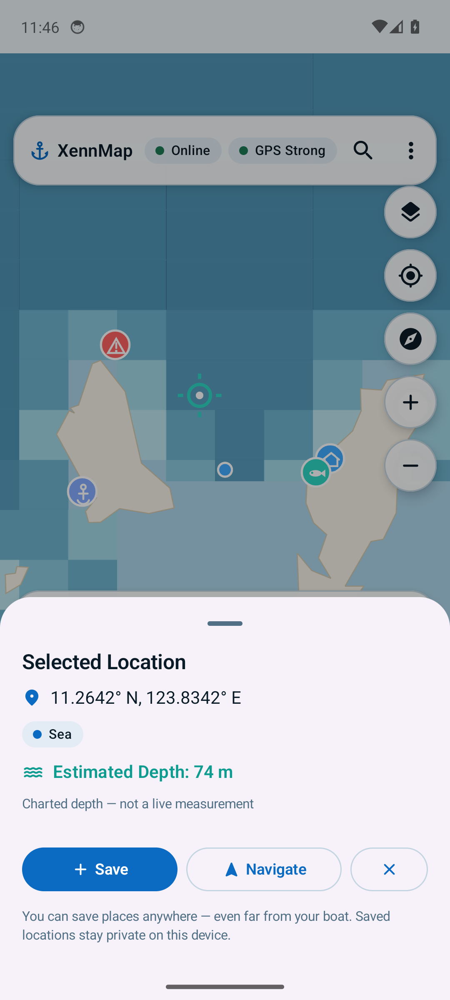
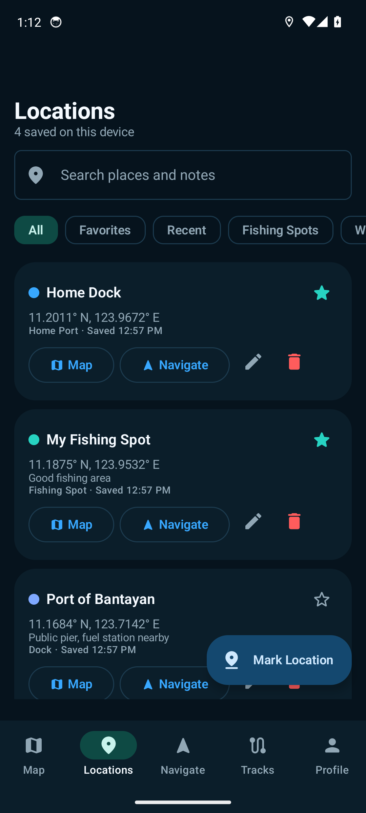
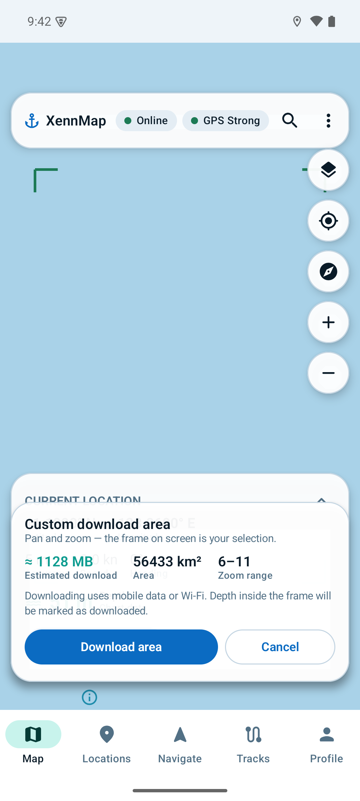

# 🌊 XennMap

**Your Offline Sea Map Companion**

XennMap is an Android app built for Filipino fishermen, boat operators and coastal
travelers who need marine map information **even when there is no internet or cell
signal**. Plan your trip at home, sail offline, and let the chart depth follow you.

[](https://www.android.com/)
[](https://kotlinlang.org/)
[](../../releases)
[](LICENSE)

---

## 📦 Download

**[⬇️ Download the latest XennMap APK](../../releases/latest)** — grab `app-release.apk`
from the release page, install it, and you're ready to sail.

> Android may ask for permission to install apps from your browser or file manager
> the first time. Allow it once and install as usual.

## 📱 Screenshots

| | |
|---|---|
|  |  |
| *Offline chart with depth grid* | *Tap anywhere — see coordinates, sea/land and depth* |
|  |  |
| *Saved places with chart depth and distance* | *Frame your own download area* |

## 🌊 What is XennMap?

Fishermen head out before dawn, far from cell towers. Maps that need data are
useless at sea — and knowing the water depth where you drop anchor matters.

XennMap is an **offline-first marine companion**: download your home waters once
over Wi-Fi, and the chart, depth bands, saved spots and navigation assistance keep
working with **zero signal**. It works two ways:

* **"Where am I?"** — live GPS position, chart depth under the boat, breadcrumb trails.
* **"Where do I want to go?"** — pan the map, tap any point, save it, and navigate there tomorrow.

## ✨ Features

* 🗺️ **Offline-first marine maps** — MapLibre-based chart with Philippine coastline; download all coastal areas or frame your own custom area
* 📡 **GPS location** — position, accuracy, speed and heading, with or without Play Services
* 🌡️ **Bathymetry** — nationwide depth-band grid with contours and labels, clearly labeled as chart data (never live sonar)
* 📌 **Save any location** — from your GPS position *or* by tapping anywhere on the map; fishing spots, home ports, docks, dangers, waypoints, favorites
* 🧭 **Navigation assistance** — distance, bearing, compass direction and estimated charted depth at your destination
* 🛰️ **Track recording** — breadcrumb trails with distance and duration
* 🔔 **Notify list** — pin planned destinations to the Dashboard
* 🌙 **Dark & Light modes** — dark ocean theme and light paper-chart theme, plus system default
* 🔐 **Private by design** — everything stays on your device; nothing is uploaded, ever
* ⚙️ **Units** — km/nautical miles, meters/feet/fathoms, km/h/knots

## 🗺️ Offline-First

Works fully offline:

* Map rendering, GPS position, depth model, saved places, navigation assistance and track recording
* Downloaded areas render with zero signal (tiles are stored on-device)

Needs internet once:

* Downloading map areas (OpenStreetMap-based tiles)

Limits to know about:

* The depth layer is a **synthetic demonstration model** for the MVP — it shows where real
  chart data would go and is labeled as such. Swap in official bathymetry (GEBCO/NAMRIA) for
  production use. It is never presented as live sonar.

## 🧭 Navigation & Safety

XennMap is **navigation assistance only**. It does **not** replace:

* official nautical charts
* professional marine navigation systems
* safety equipment
* local maritime regulations
* weather information
* your own judgment at sea

The depth layer shows chart data — never a live sonar measurement from your phone.

## 🔐 Privacy

Saved fishing spots, waypoints, favorites, tracks and settings are **stored locally on
your device**. XennMap has no accounts, no analytics and no cloud sync — your secret
spots stay yours.

## 🛠️ Technology

| | |
|---|---|
| Language | Kotlin 2.0 |
| UI | Jetpack Compose + Material 3 |
| Map | MapLibre Native (no Google Maps dependency) |
| Architecture | MVVM + Clean Architecture (data / domain / presentation) |
| Async | Kotlin Coroutines & Flow |
| DI | Hilt |
| Storage | Room + DataStore |
| Background | WorkManager |
| Location | Play Services FusedLocation + AOSP LocationManager fallback |

## 🏗️ Architecture

```
app/src/main/java/com/xennmap/
├── data/           Room, DataStore, location, offline maps, bathymetry, tracking
├── domain/         models, repository interfaces, use cases
├── presentation/   Compose screens, ViewModels, theme-driven shell
├── ui/             theme + shared components
├── di/             Hilt modules
└── utils/          geodesy, formatting, GeoJSON
```

## 🔧 Development

```bash
git clone https://github.com/Xen-Zeru/XennMap.git
```

Open the project in **Android Studio** (or run `./gradlew assembleDebug`).
Requirements: JDK 17+, Android SDK with platform 35. No API keys needed — the map
uses MapLibre with OpenStreetMap-based tiles from [OpenFreeMap](https://openfreemap.org/)
(respect their usage policy and the OSM ODbL license).

Release builds read `keystore.properties` (gitignored) for signing — see the file
format in `app/build.gradle.kts`.

## 📄 License

[MIT](LICENSE) — map data © OpenStreetMap contributors (ODbL); coastline geoBoundaries (CC BY 4.0).

---

*XennMap is a navigation-assistance app and does not replace official nautical charts
or professional marine navigation equipment. Always prioritize safety at sea.*
